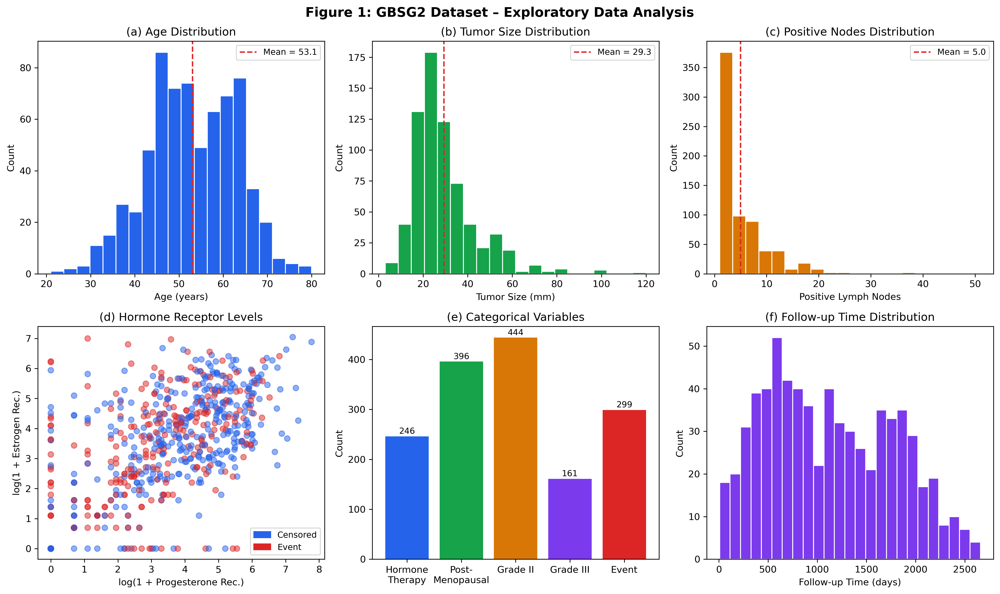
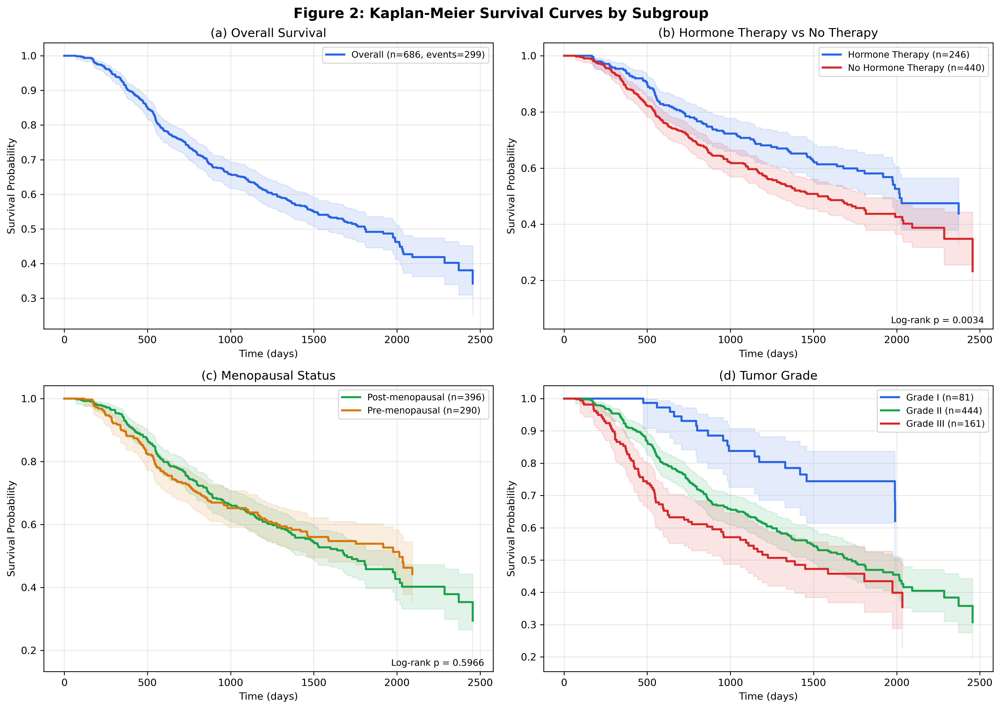
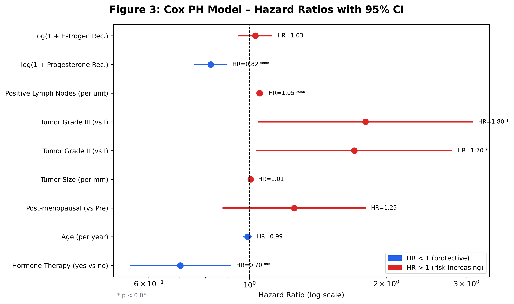
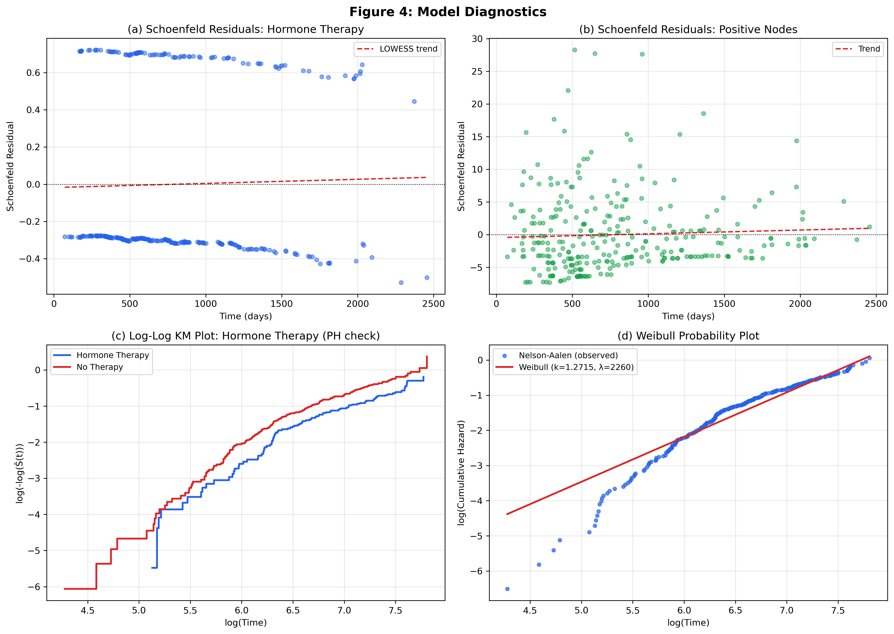
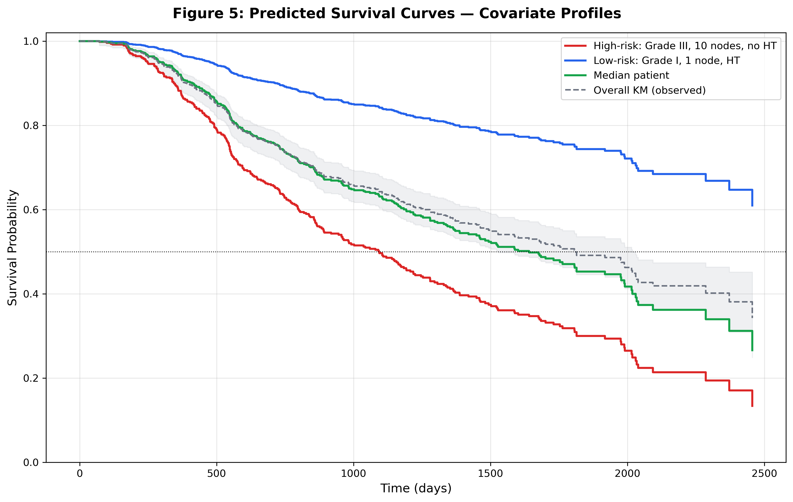

# Survival Analysis of Recurrence-Free Survival in Breast Cancer Patients
### The GBSG2 Study — STA 6903 | The University of Texas at San Antonio | Spring 2026

**Contributors:** Eric Cantu & Marco Ortiz  
**Course:** STA 6903 — Survival Analysis

---

## Overview

This project applies three survival analysis methods — **Kaplan-Meier**, **Cox Proportional Hazards**, and **Weibull parametric regression** — to the GBSG2 clinical trial dataset to characterize recurrence-free survival (RFS) in breast cancer patients and identify key prognostic factors.

The primary clinical question: *Does adjuvant hormone therapy significantly reduce the hazard of breast cancer recurrence?*

---

## Dataset

**German Breast Cancer Study Group 2 (GBSG2)**

- **Source:** Originally from the `TH.data` package in R (RStudio). The `.csv` was exported from R and read into Python for this analysis.
- **Sample:** 686 women with primary node-positive breast cancer
- **Outcome:** Recurrence-free survival time (days)
- **Event indicator:** `cens` — 1 = recurrence/death, 0 = censored

| Variable | Type | Description |
|---|---|---|
| `horTh` | Categorical | Hormonal therapy administered (yes/no) |
| `age` | Continuous | Patient age at enrollment (years) |
| `menostat` | Categorical | Menopausal status (Pre/Post) |
| `tsize` | Continuous | Tumor diameter (mm) |
| `tgrade` | Ordinal | Tumor histological grade (I/II/III) |
| `pnodes` | Continuous | Number of positive lymph nodes |
| `progrec` | Continuous | Progesterone receptor content (fmol/l) |
| `estrec` | Continuous | Estrogen receptor content (fmol/l) |
| `time` | Continuous | Recurrence-free survival time (days) |
| `cens` | Binary | Event indicator |

**Key descriptive statistics:**

| Statistic | Value |
|---|---|
| Sample size | 686 |
| Events (recurrences/deaths) | 299 (43.6%) |
| Censoring rate | 56.4% |
| Median age | 53 years |
| Median tumor size | 25 mm |
| Median positive lymph nodes | 3 |
| Median recurrence-free survival (KM) | 1,807 days (~60 months) |
| Patients receiving hormone therapy | 35.9% |
| Post-menopausal patients | 57.7% |

---

## Methods

All models were implemented from scratch in Python using `NumPy`, `SciPy`, and `Pandas` — no `lifelines` or dedicated survival library was used.

### 1. Kaplan-Meier Estimator
Non-parametric estimation of the survival function using the product-limit formula. Pointwise 95% confidence intervals computed via the Greenwood formula on the complementary log-log scale. Subgroup comparisons performed with the log-rank test.

### 2. Cox Proportional Hazards Model
Semi-parametric model of the form:

$$h(t \mid x) = h_0(t) \cdot \exp(\beta_1 x_1 + \cdots + \beta_p x_p)$$

Parameters estimated by maximizing the partial log-likelihood via L-BFGS-B optimization. Standard errors derived from the numerical Hessian. Baseline hazard estimated using the Breslow estimator. Model performance assessed via the concordance index (C-statistic).

Proportional hazards assumption checked using:
- Schoenfeld residual plots vs. event time
- Log-minus-log KM plots

### 3. Weibull Parametric Model
Fitted to the marginal survival distribution via maximum likelihood. Shape parameter $\hat{k} = 1.2715$ (monotonically increasing hazard), scale parameter $\hat{\lambda} = 2259.9$ days. Fit evaluated via the Weibull probability plot (log cumulative hazard vs. log time).

---

## Results

### Primary Hypothesis Test

$$H_0: \beta_{\text{horTh}} = 0 \quad \text{vs.} \quad H_A: \beta_{\text{horTh}} \neq 0$$

Wald test statistic: $Z = -0.3506 / 0.1291 = -2.715$, $p = 0.0066$

**Reject $H_0$ at $\alpha = 0.05$.** Hormone therapy significantly reduces the hazard of breast cancer recurrence.

---

### Cox PH Model Results

| Covariate | Coef | HR | 95% CI | p-value |
|---|---|---|---|---|
| Hormone Therapy (Yes vs No) | −0.3506 | **0.704** | (0.547, 0.907) | 0.0066 ** |
| Age (per year) | −0.0096 | 0.990 | (0.973, 1.008) | 0.294 |
| Post-menopausal (vs Pre) | +0.2264 | 1.254 | (0.875, 1.798) | 0.218 |
| Tumor Size (per mm) | +0.0062 | 1.006 | (0.998, 1.014) | 0.117 |
| Tumor Grade II (vs I) | +0.5312 | **1.701** | (1.038, 2.787) | 0.035 * |
| Tumor Grade III (vs I) | +0.5890 | **1.802** | (1.049, 3.097) | 0.033 * |
| Positive Lymph Nodes (per unit) | +0.0516 | **1.053** | (1.037, 1.069) | <0.001 *** |
| log(1 + Progesterone Rec.) | −0.1954 | **0.823** | (0.759, 0.891) | <0.001 *** |
| log(1 + Estrogen Rec.) | +0.0295 | 1.030 | (0.948, 1.118) | 0.483 |

**C-statistic: 0.696** (~69.6% discrimination accuracy)

`*** p<0.001  ** p<0.01  * p<0.05`

---

## Visualizations

### Figure 1 — Exploratory Data Analysis
Distributions of age (mean = 53.1 yrs), tumor size (mean = 29.3 mm), and positive lymph nodes (mean = 5.0) — all right-skewed. Hormone receptor levels plotted on log(1+x) scale. Overall event rate: 43.6%.



---

### Figure 2 — Kaplan-Meier Survival Curves
KM curves stratified by hormone therapy status, menopausal status, and tumor grade. Hormone therapy showed a statistically significant survival benefit (log-rank χ² = 8.565, p = 0.0034). Menopausal status was not significant (p = 0.5966). Grade I tumors had the best survival outcomes.



---

### Figure 3 — Forest Plot (Cox PH Hazard Ratios)
Blue = protective (HR < 1), Red = increased risk (HR > 1). Statistically significant covariates marked with asterisks.



---

### Figure 4 — Model Diagnostics
**(a–b)** Schoenfeld residuals for hormone therapy and positive lymph nodes show no systematic trend over time — no violation of the proportional hazards assumption detected. **(c)** Log-log KM plot for hormone therapy groups appear approximately parallel, further supporting the PH assumption. **(d)** Weibull probability plot is approximately linear over the primary follow-up range, consistent with Weibull behavior.



---

### Figure 5 — Predicted Cox PH Survival Curves
Predicted survival for three representative covariate profiles: high-risk (Grade III, 10 nodes, no HT), low-risk (Grade I, 1 node, HT), and a median patient. Clear separation between curves demonstrates strong prognostic stratification.



---

## Key Conclusions

- **Hormone therapy** is the strongest modifiable protective factor — approximately **30% reduction in recurrence hazard** (HR = 0.704, p = 0.0066), independently confirmed by KM log-rank test (p = 0.0034).
- **Positive lymph nodes** and **higher tumor grade** are the strongest non-modifiable predictors of worse outcomes.
- **Progesterone receptor levels** are protective (HR = 0.823, p < 0.001), consistent with hormone receptor-positive tumors being less aggressive.
- The **Weibull shape parameter k̂ ≈ 1.27 > 1** indicates recurrence risk increases monotonically over follow-up time.
- Age, menopausal status, tumor size, and estrogen receptors were not statistically significant in the multivariable model.

---

## Repository Structure

```
gbsg2-survival-analysis/
│
├── GBSG2.csv                                        # Dataset (exported from R)
├── Survival_Analysis_Python_Visualizations.ipynb    # Main analysis notebook
│
├── figures/                                         # All generated figures
│   ├── fig1_eda.png
│   ├── fig2_km.png
│   ├── fig3_forest.png
│   ├── fig4_diagnostics.png
│   └── fig5_predicted_survival.png
│
├── reports/
│   └── Data_Analysis_Project_Survival_Analysis.pdf  # Full written report
│
└── README.md
```

---

## Tech Stack

| Tool | Purpose |
|---|---|
| Python 3 | Core language |
| NumPy / SciPy | Numerical optimization, statistical tests |
| Pandas | Data manipulation |
| Matplotlib / Seaborn | Visualization |
| L-BFGS-B | Cox PH partial likelihood optimization |
| R / RStudio | Original GBSG2 dataset source (exported to CSV) |

---

## Limitations

- Analysis assumes **non-informative censoring** (censoring unrelated to recurrence risk).
- Cox PH model assumes **proportional hazards** remain constant over time — diagnostics show no major violations, but time-varying effects should be explored in future work.
- The Weibull model was fit to the **marginal survival distribution without covariates** — a full parametric regression would allow direct comparison with the Cox model.
- Dataset is restricted to **node-positive patients** and may not generalize to node-negative breast cancer populations.
- Potential confounders not in the dataset (chemotherapy regimen, comorbidities) may affect observed associations.

---

*Spring 2026 · STA 6903 Survival Analysis · The University of Texas at San Antonio*
